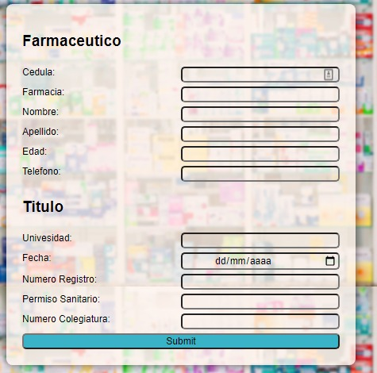

# Sistema de Farmacia

> Integrantes
> > Daniel Porras v26640273 <br>
> > Adrian Moreno v25936929

<br>
<br>


#### <u>Modelo Entidad - Relacion</u>


<br>
<br>

<div style="page-break-after: always; visibility: hidden"></div>

#### <u>Diagrama de clases</u>


<br>
<br>

<div style="page-break-after: always; visibility: hidden"></div>

#### <u>Modelo Relacional</u>


<br>
<br>

<div style="page-break-after: always; visibility: hidden"></div>

#### <u>Diccionario de Datos</u>

<br>

##### <u>compras</u>

<div align="justify">
La tabla <b>compras</b> contiene informacion de las compras hechas o por pagar realizadas por la farmacia, haciendo referencia a las ordenes de compra emitidas por el analista de compras perteneciente a un farmacia.
</div>

|CAMPO|TIPO|DESCRIPCION|
|:---:|:---:|---|
|id(PK)|INT|Codigo de compra, utilizada como llave primaria|
|id_pedido(FK)|INT|Codigo de pedido realizado por la farmacia, llave foranea proveniente de **pedidos**|
|vencimiento|DATE|Fecha de vencimiento del pago de la compra|
|cancelado|BOOL|Indicador de si la compra fue cancelada o no|

<br>
##### <u>compra_medicamento</u>

<div align="justify">
La tabla <b>compra_medicamento</b>es una tabla de paso para romper la relacion <b>muchos a muchos</b> que existe entre <b>compras</b> y <b>medicamentos</b>, contiene los codigos de las compras y los medicamentos adquiridos.
</div>


|CAMPO|TIPO|DESCRIPCION|
|:---:|:---:|---|
|id(PK)|INT|Identificador de la relacion compra-medicamento, utilizado como llave primaria|
|id_compra(FK)|INT|Codigo de compra, llave foranea proveniente de **compras**|
|id_medicamento(FK)|INT|Codigo de medicamento, llave foranea proveniente de **medicamentos**|

<div style="page-break-after: always; visibility: hidden"></div>

<br>
##### <u>empleados</u>

<div align="justify">
La tabla <b>empleados</b> contiene los datos de los empleados que laboran en una farmacia.
</div>

|CAMPO|TIPO|DESCRIPCION|
|:---:|:---:|---|
|ci(PK)|INT|Cedula del empleado, utilizada como llave primaria|
|id_farmacia(FK)|INT|Codigo de farmacia donde labora el empleado, llave foranea proveniente de **farmacias**|
|nombre|VARCHAR(45)|Nombre del empleado|
|apellido|VARCHAR(45)|Apellido del empleado|
|edad|INT|Edad del empleado|
|cargo|VARCHAR(45)|Cargo que rige el empleado en la farmacia|
|telefono|VARCHAR(45)|Numero de contacto del empleado|

<br>
##### <u>farmacias</u>

<div align="justify">
La tabla <b>farmacias</b> contiene los datos de las farmacias registradas en el sistema.
</div>

|CAMPO|TIPO|DESCRIPCION|
|:---:|:---:|---|
|id(PK)|INT|Codigo de la farmacia, utilizado como llave primaria|
|nombre|VARCHAR(45)|Nombre de la farmacia como local|
|ubicacion|VARCHAR(45)|Ubicacion geografica de la farmacia|

<div style="page-break-after: always; visibility: hidden"></div>

<br>
##### <u>inventario</u>

<div align="justify">
La tabla <b>inventario</b> es una tabla de paso que se utiliza para resolver la relacion **muchos a muchos** entre <b>farmacias</b> y <b>medicamentos</b>, contiene los datos necesarios para registrar los medicamentos que puede ofrecer la farmacia.
</div>

|CAMPO|TIPO|DESCRIPCION|
|:---:|:---:|---|
|id(PK)|INT|Condigo de la relacion farmacia-medicamento, utilizado como llave primaria|
|id_farmacia(FK)|INT|Condigo de la farmacia, llave foranea proveniente de **farmacias**|
|id_medicamento(FK)|INT|Codigo de medicamento, llave foranea proveniente de **medicamentos**|
|cantidad|INT|Cantidad de medicamento disponible en esa farmacia|

<br>
##### <u>laboratorios</u>

<div align="justify">
La tabla <b>laboratorios</b> contiene los datos de los laboratorios que proveen los medicamentos a las farmacias.
</div>

|CAMPO|TIPO|DESCRIPCION|
|:---:|:---:|---|
|id(PK)|INT|Codigo de la farmacia, utilizado como llave primaria|
|nombre|VARCHAR(45)|Nombre de la farmacia como empresa|
|direccion|VARCHAR(45)|Ubicacion geografia del laboratorio|
|telefono|VARCHAR(45)|Numero de contacto del laboratorio|

<div style="page-break-after: always; visibility: hidden"></div>

<br>
##### <u>laboratorio_medicamento</u>

<div align="justify">
La tabla <b>laboratorio-medicamento</b> es utilizada como tabla de paso para resolver la relacion <b>muchos a muchos</b> entre <b>laboratorio</b> y <b>medicamento</b>.
</div>

|CAMPO|TIPO|DESCRIPCION|
|:---:|:---:|---|
|id(PK)|INT|Codigo de la relacion, utilizado como llave primaria|
|id_laboratorio(FK)|INT|Codigo del laboratorio, llave foranea proveniente de **laboratorios**|
|id_medicamento(FK)|INT|Codigo de medicamento, llave foranea proveniente de **medicamentos**|

<br>
##### <u>medicamentos</u>

<div align="justify">
La tabla <b>medicamentos</b>contiene los datos de las medicinas que ofrece la farmacia.
</div>

|CAMPO|TIPO|DESCRIPCION|
|:---:|:---:|---|
|id(PK)|INT|Codigo del medicamento, utilizado como llave foranea|
|monodorga|VARCHAR(45)|Componente quimico del medicamento|
|presentacion|VARCHAR(45)|Formato de predentacion del medicamento para ser utilizado|
|accion|VARCHAR(45)|Funcion del medicamento|
|precio|INT|Valor monetario del medicameto|

<div style="page-break-after: always; visibility: hidden"></div>

<br>
##### <u>pasantias</u>

<div align="justify">
La tabla <b>pasantias</b> contiene los datos tecnicos de los pasantes que laboran en la farmacia.
</div>

|CAMPO|TIPO|DESCRIPCION|
|:---:|:---:|---|
|ci(PK)|INT|Cedula del empleado, llave foranea proveniente de **empleados**, utilizado como llave primaria|
|institucion|VARCHAR(45)|Institucion de donde proviene el pasante|
|especialidad|VARCHAR(45)|Rama de especializacion del pasante|
|f_inicio|DATE|Fecha de inicio de la pasantia|
|f_final|DATE|Fecha de culminacion de la pasantia|
|n_permiso|INT|Codigo de permiso para laborar en la farmacia|
|minoria_edad|BOOL|Indicador de minoria de edad del pasante|
|activo|BOOL|Indicador de actividad del pasante como empleado de la farmacia|

<br>
##### <u>pedido_medicamento</u>

<div align="justify">
La tabla <b>pedido-medicamento</b> es utilizada como tabla de paso para resolver la relacion <b>muchos a muchos</b> entre <b>pedidos</b> y <b>medicamentos</b>.
</div>

|CAMPO|TIPO|DESCRIPCION|
|:---:|:---:|---|
|id(PK)|INT|Codigo de la relacion, utilizado como llave primara|
|id_pedido(FK)|INT|Codigo de la orden de compra|
|id_medicamento(FK)|INT|Codigo del medicamento relacionado a la orden de compra|

<div style="page-break-after: always; visibility: hidden"></div>

<br>
##### <u>pedidos</u>

<div align="justify">
La tabla <b>pedidos</b> contiene los datos de las ordenes de compra emitidas por el analista de compras proveniente de una farmacia.
</div>

|CAMPO|TIPO|DESCRIPCION|
|:---:|:---:|---|
|id(PK)|INT|Codigo de la orden de compra, utilizado como llave primara|
|id_farmacia(FK)|INT|Codigo de la farmacia, llave foranea proveniente de **farmacias**|
|id_laboratorio(FK)|INT|Codigo de laboratorio, llave foranea proveniente de **laboratorios**|
|id_empleado(FK)|INT|Codigo de empleado analista, llave foranea proveniente de **empleados**|
|forma_pago|VARCHAR(45)|Modalidad de pago de la orden de compra|

<br>
##### <u>responsable</u>

<div align="justify">
La tabla <b>responsable</b> contiene los datos del responsable legales de los pasantes si estos son menores de edad.
</div>

|CAMPO|TIPO|DESCRIPCION|
|:---:|:---:|---|
|ci(PK)|INT|Cedula del empleado, llave foranea proveniente de **empleados**, utilizada como llave primaria|
|ci_representante|INT|Cedula del responsable|
|nombre|VARCHAR(45)|Nombre del responsable|
|apelido|VARCHAR(45)|Apellido del responsable|
|telefono|VARCHAR(45)|Telefono de contacto del responsable|

<div style="page-break-after: always; visibility: hidden"></div>

<br>
##### <u>titulos</u>

<div align="justify">
La tabla <b>titulos</b> contiene los datos del titulo obtenido por un farmaceutico.
</div>

|CAMPO|TIPO|DESCRIPCION|
|:---:|:---:|---|
|ci(PK)|INT|Cedula del empleado, llave foranea proveniente de **empleados**, utilizada como llave primaria|
|universidad|VARCHAR(45)|Universidad de donde es egresado el farmaceutico|
|fecha|DATE|Fecha de egreso del farmaceutico|
|n_registro|INT|Numero de registro del titulo|
|p_sanitario|INT|Numero de permiso sanitario|
|n_colegiatura|INT|Numero de colegiatura del titulo|

<div style="page-break-after: always; visibility: hidden"></div>

<br>
<br>
#### <u>Formularios</u>

##### <u>Empleado</u>


<div style="page-break-after: always; visibility: hidden"></div>

<br>
<br>
##### <u>Farmaceutico</u>



<div style="page-break-after: always; visibility: hidden"></div>

<br>
<br>
##### <u>Pasante</u>


<br>
<br>
##### <u>Medicamento</u>


<div style="page-break-after: always; visibility: hidden"></div>

<br>
<br>
##### <u>Pedido</u>


<div style="page-break-after: always; visibility: hidden"></div>

<br>
<br>
#### <u>Reportes</u>

###### <u>1. Query</u> 

```sql
SELECT f.nombre,e.nombre,e.apellido,e.ci,p.institucion,p.f_final 
FROM farmaciatst.empleados e INNER JOIN farmaciatst.farmacias f ON e.id_farmacia=f.id
INNER JOIN farmaciatst.pasantias p ON e.ci=p.ci 
WHERE p.activo=1 ORDER BY f.nombre;
```

###### <u>Reporte</u>


<div style="page-break-after: always; visibility: hidden"></div>

###### <u>2. Query</u> 

```sql
SELECT l.nombre,c.vencimiento, sum(m.precio)
FROM farmaciatst.compras c INNER JOIN farmaciatst.compra_medicamento cm on c.id=cm.id_compra
INNER JOIN farmaciatst.pedidos p ON c.id_pedido=p.id 
INNER JOIN farmaciatst.laboratorios l ON p.id_laboratorio=l.id
INNER JOIN farmaciatst.medicamentos m ON cm.id_medicamento=m.id
INNER JOIN farmaciatst.farmacias f ON p.id_farmacia=f.id
WHERE c.cancelado=0 AND f.nombre="$nombreFarmacia" 
AND f.ubicacion="$ubicacion" 
GROUP BY c.id ORDER BY l.nombre;
```

###### <u>Reporte</u>


###### <u>3. Query</u> 

```sql
SELECT l.nombre,c.vencimiento, sum(m.precio)
FROM farmaciatst.compras c INNER JOIN farmaciatst.compra_medicamento cm on c.id=cm.id_compra
INNER JOIN farmaciatst.pedidos p ON c.id_pedido=p.id 
INNER JOIN farmaciatst.laboratorios l ON p.id_laboratorio=l.id
INNER JOIN farmaciatst.medicamentos m ON cm.id_medicamento=m.id
INNER JOIN farmaciatst.farmacias f ON p.id_farmacia=f.id
WHERE c.cancelado=0 AND f.nombre="$nombreFarmacia" 
GROUP BY c.id ORDER BY l.nombre;
```

###### <u>Reporte</u>


<div style="page-break-after: always; visibility: hidden"></div>

###### <u>4. Query</u> 

```sql
SELECT m.id,m.monodroga,l.nombre,i.cantidad
FROM farmaciatst.inventario i INNER JOIN farmaciatst.farmacias f on i.id_farmacia=f.id
INNER JOIN farmaciatst.medicamentos m ON i.id_medicamento=m.id
INNER JOIN farmaciatst.laboratorio_medicamento ml ON m.id=ml.id_medicamento
INNER JOIN farmaciatst.laboratorios l ON ml.id_laboratorio=l.id
WHERE f.nombre="$nombreFarmacia" AND m.accion="$accion";
```

###### <u>Reporte</u>


